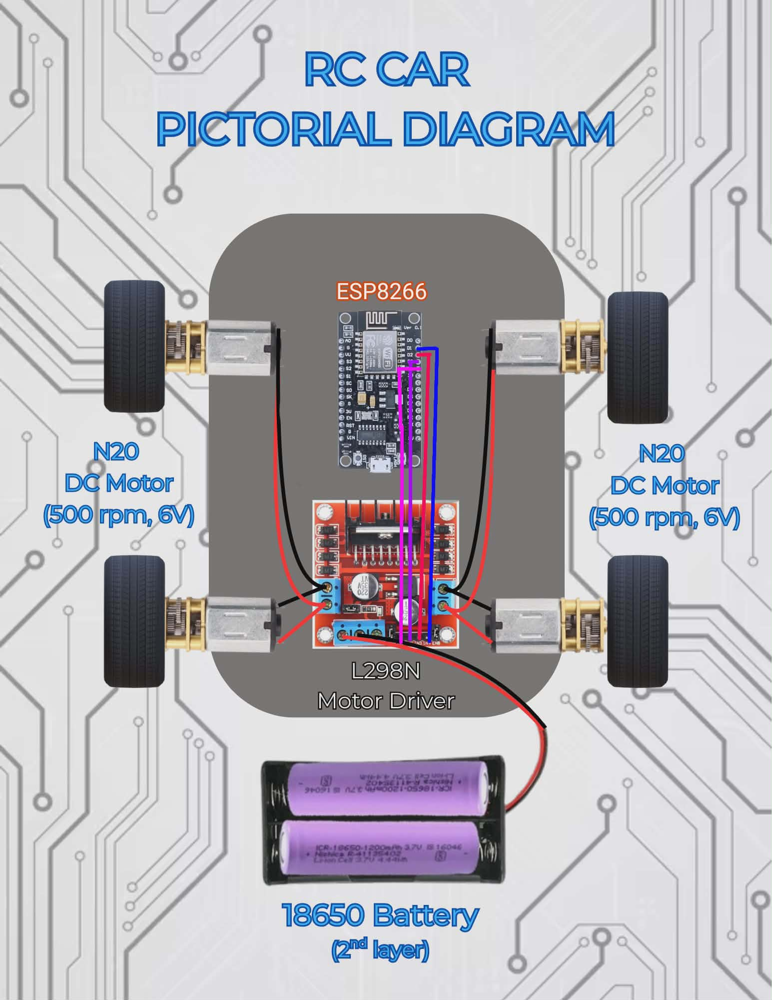
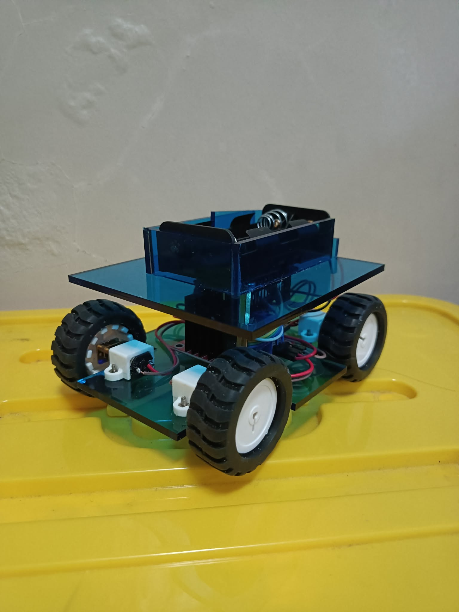
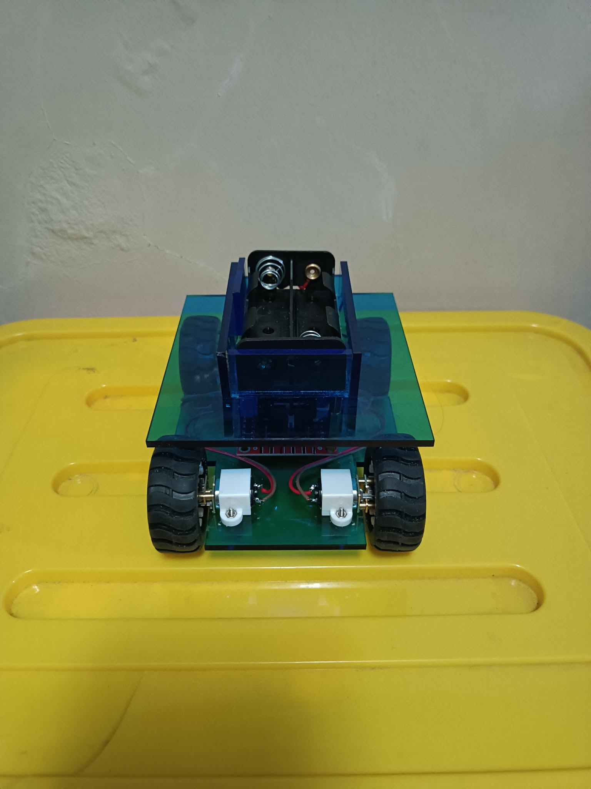
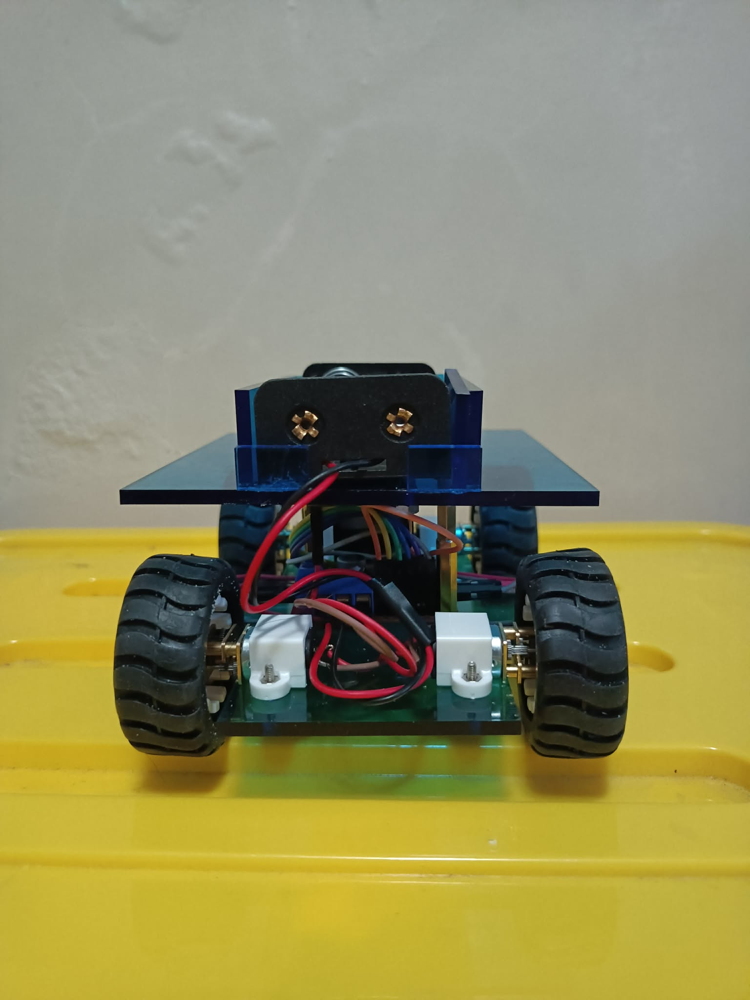
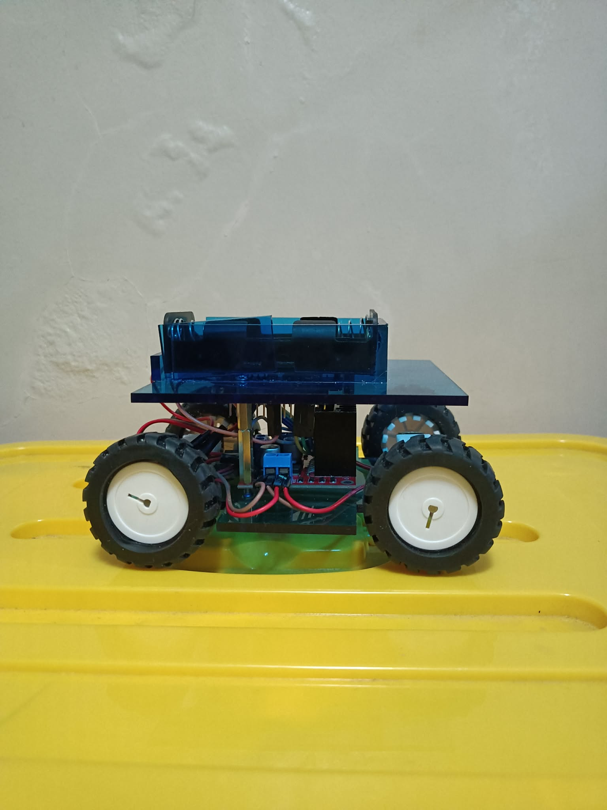
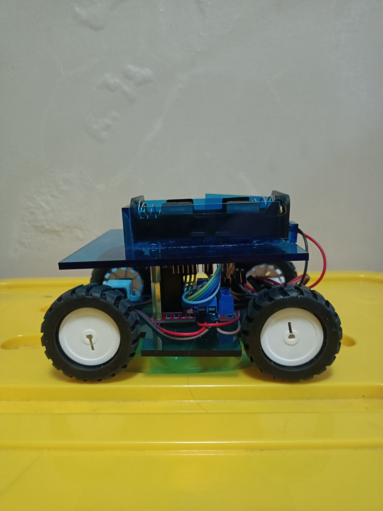

# RC CAR PROJECT

## Introduction / Overview
This RC Car Project is a WiFi-controlled embedded systems vehicle built using an ESP8266 microcontroller and an L298N motor driver. It enables real-time wireless control through a simple web interface, making it suitable for learning robotics, motor control, and IoT-based systems.

---

## Components Used
- ESP8266 (NodeMCU / Wemos D1 mini)  
- L298N Motor Driver Module  
- 2x DC Geared Motors  
- 2S 18650 Battery Pack  
- Chassis with wheels  
- Jumper wires  

---

## Key Features
- Wireless control via WiFi (Access Point mode)  
- Web-based interface (no app required)  
- Forward, backward, left, right, and stop control  
- PWM speed control support  
- Expandable for sensors and automation  
- Battery-powered mobile system  

---

## System Summary
The ESP8266 acts as the central controller, hosting a web server that receives user commands. These commands are translated into GPIO signals sent to the L298N motor driver, which controls the DC motors for movement. The system runs on a 2S 18650 battery pack, providing portable power for full mobility.

---

## RC Car Pictorial Diagram

  
RC Car: Blues

  

---

## RC Car Pictures

  
RC Car: Blues

  

